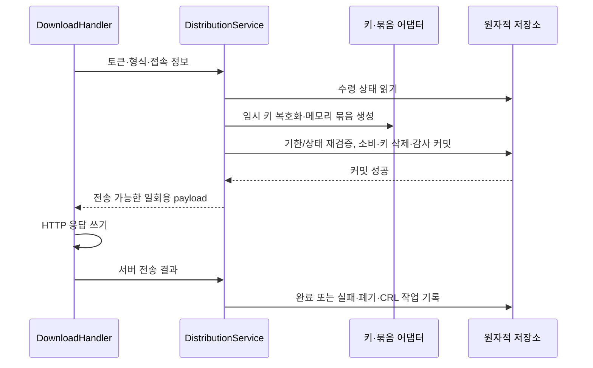
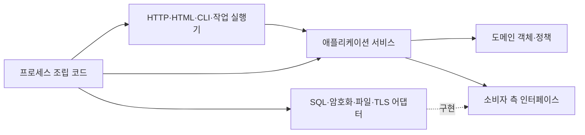

# 백엔드 객체 설계를 위한 요구사항과 책임 정리

## 목적과 근거

백엔드 구조체·인터페이스·패키지 설계에 필요한 입력 자료다. 기존 정책에서 확인한 사실과 이를 구현하기 위한 객체 후보를 구분한다. 아래 이름은 책임을 설명하는 후보이며 모든 후보를 별도 클래스나 인터페이스로 만들라는 뜻이 아니다. 이 단계에서 서버나 마이그레이션 실행기를 구현하지 않는다.

정책의 근거는 [제품·운영·보안](./architecture.md), [인증서 수명·배포](./certificate-lifecycle.md), [PKI import](./pki-import.md)다. [API 계약](./api-contract.md)은 외부 입력·출력, [데이터 모델](./data-model.md)은 보존할 상태의 근거로 사용한다. 테이블 수나 엔드포인트 수를 서비스 수로 옮기지 않는다.

확정 환경은 Go 단일 프로세스, HTML/HTMX와 JSON API, DB 세션, Docker 단일 인스턴스다. SQLite·PostgreSQL·MySQL·MariaDB를 지원해야 하지만 DB별 구현 차이는 업무 객체에 들어가지 않는다. 초기 관리자는 전체 관리자 한 명이며 장기 CA 권한·ACME·교차 서명은 확장 지점으로만 고려한다.

## 행위자와 진입점

| 행위자 | 수행 가능한 작업 | 서버가 확인해야 할 것 |
| --- | --- | --- |
| 최초 설치자 | 첫 관리자 생성 | 계정 미생성 상태, 최초 생성의 원자성. 초기 설정 승인 토큰 없음 |
| 로그인한 관리자 | PKI 설정, CA·Leaf 관리, 링크 생성, 폐기, import, HTTPS 교체, 감사 조회 | 현재 계정·세션 상태, CSRF, 작업 권한, 대상 version |
| 다운로드 링크 소지자 | 토큰에 묶인 공개 자료 또는 개인키 수령 | 용도·대상·기한·소비 상태. 다른 관리 권한 없음 |
| 익명 공개 자료 클라이언트 | 고정 CA 인증서·체인·CRL 조회 | URL의 불변 인증서 ID와 게시 CRL 연결 |
| 컨테이너 운영자 | CLI 비밀번호 복구, 저장 키 rotate, 복원 정리, 접근 불가 시 HTTPS 복구 | 로컬 실행 권한과 작업별 온라인/오프라인 실행 조건 |
| 내부 작업 실행기 | 수령 만료, CRL 발행, 감사 정리, 재시작 복구 | 제한된 시스템 작업 신원, 영속 작업 상태·중복 방지 |

HTTP 요청이나 CLI 인자가 자신을 관리자/system이라고 선언할 수 없어야 한다. 인증 계층이 검증한 Actor와 정규화한 접속 IP·진단 요청 ID를 서비스에 전달한다. 요청 ID와 Idempotency-Key는 목적이 다르다.

## 유스케이스 목록

각 결과는 성공 응답에 필요한 공개 데이터이며 개인키·토큰을 일반 결과 객체에 섞지 않는다.

| ID | 유스케이스·입력 | 결과·같이 바뀌는 상태 | 책임 후보·근거 |
| --- | --- | --- | --- |
| U01 | 최초 관리자 생성: 계정명·비밀번호 | 계정 생성과 공개 가입 종료. PKI 설정은 재개 가능 | SetupService + Account / 운영 문서 |
| U02 | 로그인·로그아웃·세션 확인 | 세션 생성/삭제, 현재 계정 상태·epoch 검증 | IdentityService / 운영·API |
| U03 | CLI 재설정 시작, 웹 비밀번호 변경 | 시작 즉시 reset_pending·세션 전부 삭제·3시간 링크. 완료 시 토큰 소비·차단 해제 | IdentityService / 운영 문서 |
| U04 | 서비스 설정 변경: URL·기본 기간·교체 주기 등 | version 변경. 기존 계보 설정·수령 기한을 소급 변경하지 않음 | SettingsService / 운영·수명 |
| U05 | Root/Intermediate 생성·발급 중지·종료·키 파기 | CA 관리 단위·키 세대·인증서. 발급 중지와 CRL 발행은 별도 | AuthorityService / 수명 |
| U06 | Leaf 최초 발급·갱신·새 키 재발급 | 인증서·계보·횟수·필요시 수령 권한을 한 번 반영. 응답 재생 가능 | IssuanceService / 수명 |
| U07 | 공개/개인키 링크 생성·교체 | 토큰 해시 저장, 이전 미사용 링크 무효화. 원문은 해당 응답 한 번 | DistributionService / 수명·API |
| U08 | 토큰 GET 수령·서버 전송 결과 기록 | 소비와 임시 키 삭제 후 전송. 실패 시 폐기, 새 발급은 관리자 실행 | DistributionService / 수명 |
| U09 | 인증서 폐기·Leaf 키 유출·폐기 정정 | issuer/serial 폐기 이력·변경 세대·CRL 작업. 키 유출은 같은 키의 유효 인증서 모두 대상 | RevocationService / 수명·import |
| U10 | PKI 미리보기·반영·기존 CA 키 연결·인수 확인 | 공개 자료 결과, 원자적 import. 원본 키 암호는 보존하지 않음 | ImportService / import |
| U11 | 정상/긴급 CA 전환·외부 배포 확인 | 원본/대상 관리 경계·영향 목록·대체 인증서·수동 배포 확인 | TransitionService / 수명 |
| U12 | CRL 예약·생성·게시 | 번호와 폐기 스냅샷 세대, 게시 포인터. 오래된 생성 결과 게시 방지 | CRLService / 수명 |
| U13 | HTTPS 후보 생성·검증·설치·복구 | 내부 키 보관, DB 활성 버전과 메모리 설정 전환·실패 시 복구 | TLSService / 운영 |
| U14 | 인증서·계보·감사 조회/내보내기·고정 CA 자료 제공 | 권한에 맞는 조회 DTO/파일. 조회가 발급·폐기를 실행하지 않음 | QueryService / 운영·API |
| U15 | 수령 만료·감사 보존 정리·미완료 전송 복구 | 대상 상태 재검사 후 멱등적 처리, 감사 정리와 PKI 이력 보존 분리 | 작업 실행기 + 해당 서비스 / 운영·수명 |
| U16 | 저장 키 rotate·restore-finalize | 암호문 전체 재암호화 또는 토큰/세션 무효화·대기 키 폐기·CRL 복구 | MaintenanceService / 운영 |

서비스 후보가 공유하는 정책은 별도 도메인 함수나 정책 객체로 재사용한다. 서비스끼리 서로 public 메서드를 호출하면서 중첩 트랜잭션을 만드는 구조는 피한다. 예를 들어 수령 실패에서 폐기·CRL 작업을 기록할 때 같은 트랜잭션 안의 공통 폐기 작업을 사용한다.

## 객체 후보와 보유 책임

| 객체/값 후보 | 보유할 정보 | 객체가 판단할 규칙 | 보유하지 않을 것 |
| --- | --- | --- | --- |
| Authority | 관리 ID·소속·발급 상태·선택한 CA 인증서 | 발급/종료 가능 조건. 전체 체인·인수·키 가용성은 입력 사실로 받음 | HTTP·DB 연결·평문 CA 키 |
| Certificate | 불변 DER·지문·발급자·일련번호·공개키·유효기간 | 원본 식별, 입력 시각에 대한 기간 판정 | current 포인터, 다운로드 횟수 |
| LeafSeries | 관리 항목·현재 인증서/키 세대·유효기간 정책·교체 주기 | 다음 갱신이 키 재사용인지 교체인지, 정책 변경 시 횟수 보존 | 모든 이력의 무조건 메모리 로딩 |
| KeyGeneration | 공개키 식별자·추적 시작·갱신 횟수·보관 방식 | 현재 키 세대의 추적 정보, import 이전 이력 미상 | 개인키 필수 존재 가정 |
| Delivery | 새 키의 수령 권한·기한·상태·전송 결과 | 소비 가능 여부, 실패/만료/완료 전이 | 토큰 원문·HTTP 응답 writer |
| DownloadGrant | 용도·대상·delivery 참조·기한·소비/무효화 | 해당 자료 접근과 delivery에 대한 결합 검증 | 일반 관리자 권한 |
| Revocation | issuer 키 세대+serial·사유·시각·정정 이력 | 중복·정정·폐기 유지 | 인증서 파일 필수 조건 |
| CRLPublication | 번호 상한·변경 세대·게시본·다음 시각 | 생성 결과의 게시 가능 여부 | CA 신규 발급 허용 판단과 혼합 |
| Transition | 정상/긴급 구분·원본/대상·영향·배포 확인 | 긴급 시 새 Leaf 키 요구, 외부 완료와 발급 완료 구분 | 외부 장비 설치 성공 추정 |
| Account | 자격 증명 해시·상태·auth_epoch | 로그인 허용·재설정 대기/완료 | 쿠키·HTTP 상태 코드 |
| TLSConfiguration | 검증된 인증서·체인·키 참조·버전 | 후보/활성 상태 및 교체 기록 | 일반 Leaf 수령 권한 |
| IssuancePolicy / ValidityPolicy | 프로필·SAN·알고리즘·기간·교체 주기 | 결정적 입력 검증과 발급 계획 생성 | 직접 서명·저장·시계 전역 접근 |

ID·SerialNumber·Fingerprint·PublicKey·TimeRange·NormalizedSAN·AuthorityScope를 값 타입 후보로 둔다. CAKeyGenerationID와 LeafKeyGenerationID처럼 바꿔 넣으면 의미가 달라지는 ID는 구분한다. API DTO, 도메인 객체, SQL row는 같은 필드가 있더라도 노출 목적과 검증 책임이 다르다.

한 도메인 객체를 ‘원자적으로 저장해야 하는 전부’로 과도하게 키우지 않는다. 발급은 계보·인증서·수령·요청 결과·감사 등 여러 객체를 함께 저장해야 하며, 이 원자성은 애플리케이션 작업과 저장소 경계에서 보장한다.

## 반드시 보존할 상태 전이

- Leaf 키 세대: 최초 count=0 → 같은 키 갱신 성공마다 +1 → 다음 순번이 rotate_every 이상이면 새 키/count=0. CA 변경만으로 횟수를 초기화하지 않는다. 긴급 전환은 새 키를 강제한다.
- Delivery: pending → transferring → server_completed 또는 failed. pending의 기한 만료는 expired. 재시작 시 미완료 transferring은 failed. server_completed 뒤 관리자 저장 실패 신고도 failed가 될 수 있다. terminal 상태를 pending으로 되돌리지 않는다.
- Account: active → reset_pending 시 모든 세션 삭제·epoch 증가. 유효한 재설정 완료만 active로 돌아간다. 링크 만료는 로그인 차단을 해제하지 않는다.
- CA: inventory/enabled/stopped, 인증서의 유효/폐기, 키 보유/파기, CRL active/closed는 각각 독립된 판단 축이다.
- TLS 교체: 후보 검증 → DB 활성 버전 커밋 → 메모리 적용. 적용 실패는 이전 DB/메모리로 복구하며 복구 실패는 서비스 재개를 차단한다.

수령을 기다리거나 실패한 새 키로 일반 갱신하지 않는다. import Leaf는 클라이언트가 키를 가진 이력 항목이며 최초 수령 권한을 만들지 않는다. ‘서버에서 개인키를 삭제함’과 ‘공개키로 갱신할 수 없음’은 다른 상태다.

## 호출 흐름과 트랜잭션 경계

### Leaf 발급·갱신

1. 핸들러가 입력·CSRF를 검증하고 검증된 Actor와 command를 전달한다.
2. IssuanceService가 현재 권한과 Idempotency-Key의 기존 결과를 확인한다. 재생 가능한 성공 결과는 중복 서명 없이 반환한다.
3. 계보·issuer·설정·수령·폐기/영향 상태를 읽는다. 도메인 정책이 공개키 재사용/교체와 유효기간을 포함한 IssuancePlan을 만든다.
4. 암호화 어댑터가 필요시에만 새 키를 생성하고 CA 서명 기능이 인증서를 만든다. 일반 갱신은 기존 Leaf 공개키만 필요하다.
5. 저장 경계에서 계정/권한·version·issuer 상태·일련번호 충돌을 재검사하고, 인증서·횟수·키 세대·필요한 암호문/수령 권한·요청 결과·감사를 함께 커밋한다.
6. 커밋 성공 후 공개 결과를 반환한다. 링크 생성은 별도 작업이며, 충돌/실패 시 준비한 결과와 비밀 참조를 폐기한다.

서명이 성공했다는 이유로 발급 완료라고 표시하지 않는다. 메모리에서 준비한 계획은 DB의 현재 상태를 잠그는 수단이 아니므로 커밋 직전 재검증이 필요하다.

### 개인키 수령

준비된 payload는 커밋 성공 전 핸들러가 읽을 수 없어야 한다. 실패한 소비·불명확한 커밋에는 payload를 반환하지 않는다. 서비스는 HTTP 쓰기 성공을 직접 판단하지 않고 핸들러가 관측 결과를 전달한다. 실패 기록은 연결 종료로 취소된 요청 context에만 의존하지 않고 서버 수명 안의 제한된 후처리 context로 시도한다. 기록도 실패하면 영속 transferring이 복구 근거가 된다.

공개 링크도 소비는 원자적이지만 전송 실패로 인증서를 폐기하지 않는다. 이를 동일한 ‘다운로드 실패’ 처리 함수로 합치면 안 된다.

### import와 폐기·CRL

ImportService는 크기가 제한된 입력을 파싱·암호 검증하고 공개 manifest를 만든다. commit에서는 원본 재제출과 현재 DB를 다시 검증한다. 같은 DER은 기존 항목 반환, 다른 DER의 같은 공개키는 거부하므로 단순 key_material upsert로 import 정책을 구현할 수 없다.

RevocationService는 폐기·변경 generation·CRL 작업·감사를 한 번에 저장한다. 작업 실행기가 CRLService를 호출하면 번호와 폐기 스냅샷을 예약하고 트랜잭션 밖에서 서명한 뒤 조건부 게시한다. 작업 완료 순서가 번호 순서와 다를 수 있으며 게시 실패가 폐기를 rollback시키지 않는다.

## 외부 기능 인터페이스 후보

소비하는 서비스가 필요로 하는 최소 계약부터 정한다. 다음 목록은 인터페이스를 하나씩 반드시 만들라는 요구가 아니라 입출력·실패 책임을 빠뜨리지 않기 위한 목록이다.

| 기능 경계 | 입력 → 출력 | 소비자와 필요한 보장 |
| --- | --- | --- |
| Authorization | Actor·Action·원본/대상 Scope → 허용/거부 | 모든 관리 서비스. 장기 권한은 이 지점을 확장 |
| IssuanceStore | 계보/issuer 조회, 준비된 발급 결과·기대 version → 커밋 결과 | IssuanceService. 중복 요청·횟수·수령·감사 원자성 |
| DistributionStore | grant/delivery 조회, 기대 상태·현재 시각 → 소비 결과 | DistributionService. 암호문 삭제·감사·토큰 무효화가 같은 커밋 |
| RevocationStore / CRLStore | 폐기 변경 또는 스냅샷 예약/게시 command → 결과 | 폐기·CRL·import·전환. 공통 트랜잭션 범위에서 재사용 |
| IdentityStore | 계정/세션 조회·재설정 변경 → 결과 | IdentityService. 계정 차단·세션 삭제·토큰 소비 원자성 |
| KeyGenerator | 허용 알고리즘 → 공개키와 단기 비밀 키 핸들 | 발급·내부 TLS. key generation과 저장 암호화는 구분 |
| CA signer | CA 키 참조·검증된 인증서/CRL 계획 → DER | CA·Leaf·CRL 서명. CA 개인키 원문을 서비스 결과로 내보내지 않음 |
| SecretCipher | 비밀 바이트·레코드 ID/용도/버전 → 인증 암호문, 역연산 | 신뢰된 키 어댑터·보관 기능. 저장소/다운로드 권한을 스스로 변경하지 않음 |
| BundleEncoder | 인증서·체인·필요시 Leaf 키·형식·일회성 암호 → 메모리 payload | 배포 서비스. 포맷 오류는 소비 전 실패 |
| PKIParser / ChainValidator | 제한된 업로드·선택 암호 → 검증된 자료와 공개 진단 | import·TLS. 지원 알고리즘·확장·체인 제약 확인 |
| PasswordHasher / TokenGenerator | 비밀번호 또는 난수 생성 요청 → 해시/일회성 원문 | 인증·링크. 원문 재조회 경로 없음 |
| JobStore / AuditAppender | 작업 요구·비밀 없는 감사 이벤트 → 저장 | 업무 변경과 같은 커밋. 외부 메시지 브로커 전제 없음 |
| TLSInstaller | 검증된 TLS 후보 → 메모리 적용/실패 | TLSService. DB 상태 기록과 실제 적용의 경계를 제공 |
| Clock | 현재 시각 → UTC 시각 | 만료·갱신·재시도 테스트. 정책 함수에는 시각을 인자로 전달 |
| QueryStore | 권한 범위·필터·커서 → 조회 DTO | 조회 서비스. 비밀 테이블 row 직렬화 금지 |

저장 인터페이스의 ‘발급 저장’은 이미 서명된 결과의 원자적 반영을 뜻한다. 저장소가 발급 프로필을 선택하거나 직접 키 생성·서명·HTTP 전송을 수행하지 않는다. 여러 Store를 묶는 작업은 구현 설계에서 확정한 UnitOfWork.Write와 callback의 TxStores로 통일한다.

## 의존 방향과 실행 수명

도메인에는 SQL·HTTP·템플릿·환경변수 접근을 넣지 않는다. HTML과 JSON은 같은 애플리케이션 서비스를 사용하고 CLI가 HTTP 핸들러 내부를 직접 호출하지 않는다. 패키지 이름은 domain/app/adapters 같은 계층 이름만으로 나누기보다 identity/pki/distribution 등 실제 책임과 순환 의존 여부를 보고 결정한다.

프로세스 조립 코드가 설정·저장소·키 어댑터·서비스·핸들러·worker를 생성하고 종료를 책임진다. 서비스는 장수 객체일 수 있지만 command·비밀 입력·payload는 요청/작업 수명에 묶는다. 자체 TLS 키는 서버 운영 수명에 필요한 별도 보관 대상이며 일반 일회성 Leaf 키 캐시에 넣지 않는다.

worker는 스케줄과 실행 횟수를 관리하고 업무 정책은 해당 서비스가 수행한다. CRL 예약·수령 만료 등은 재실행될 수 있으므로 저장된 상태를 다시 확인한다. 메모리 이벤트 전송만으로 폐기·감사·작업 유실 방지를 보장하지 않는다.

## 오류와 민감 데이터의 계약

| 실패 유형 | 서비스 결과 | 외부 계층의 처리 |
| --- | --- | --- |
| 입력·정책 위반 | 필드와 안정된 오류 코드 | API 422 또는 CLI 입력 오류 |
| 인증·권한 실패 | 인증 필요/허용 안 됨 | 401/403, 토큰 URL은 공개 정책에 맞춰 은닉 |
| version·동시 소비·요청 ID 충돌 | 충돌 코드·공개 현재 상태 | 409/412, 개인키 자동 재전송 금지 |
| 저장 실패·커밋 결과 불명확 | 실패/미확정 구분 | 새 요청 ID로 무조건 재발급하지 않고 기존 결과 확인 |
| 암호 해제·서명·포맷 실패 | 비밀 없는 단계별 코드 | 상태 반영 전/후에 따른 재시도 규칙 적용 |
| 전송 실패·기록 실패 | 서버 관측 결과, 미완료 상태 | 요청 실패와 수령 소비를 구분, 재시작 복구 |

도메인 오류에 HTTP 상태 코드를 저장하지 않는다. 외부 계층이 [API 계약](./api-contract.md)에 매핑한다. raw DB 오류·패키지 오류에 민감 입력이 포함될 수 있으므로 정제한 코드만 노출한다.

비밀 키·원문 토큰·암호를 일반 DTO, fmt 기반 전체 객체 로그, 감사 details, job payload, 멱등성 결과에 넣지 않는다. CA 서명 키 핸들과 배포 가능한 임시 Leaf 키를 타입/메서드 경계에서 구분한다. Go 메모리의 모든 복사본을 물리적으로 안전 삭제한다고 보장하지 않고, 접근 범위·참조 수명과 영속 사본 제거를 통제한다.

## 수집 당시 설계 항목과 확정 문서

아래 항목의 선택은 [백엔드 구현 설계](./backend-implementation.md)에 확정했다. 수집 당시 후보 목록을 근거로 보존하며 미결정 요구로 해석하지 않는다.

제품 정책을 다시 물어볼 필요 없이 개발 설계에서 다음 항목을 구체화한다.

| 미정인 설계 선택 | 이미 확정된 제약 | 다음 산출물 |
| --- | --- | --- |
| 서비스별 정확한 구조체·생성자·메서드 | 위 유스케이스를 덮고 서비스 사이 순환 호출 금지 | 책임/협력 표와 Go 시그니처 |
| 원자적 저장 인터페이스의 모양 | 발급·수령·폐기 변경과 감사/job은 같은 커밋 | 작업별 read/prepare/commit 계약 |
| 민감 payload의 소유·종료 API | 소비 커밋 전 노출 금지, 한 번만 전송, 실패 후 재사용 금지 | 키/전송 핸들 수명 설계 |
| 서로 다른 서비스가 공유하는 폐기 로직 | 수령 실패·유출·import가 중첩 트랜잭션 없이 재사용 | 공통 폐기 변경 함수와 저장 범위 |
| 인증 권한 재검증 경계 | reset_pending/epoch 변경 후 새 작업 승인 금지 | Actor 검증·commit 재검증 규칙 |
| 실제 패키지 분리 | 단일 프로세스, 업무 코드의 DB·HTTP 의존 제거 | 패키지 의존도와 조립 지점 |
| 구현 검증 전략 | 정책 테스트와 실제 저장소 경쟁 테스트를 구분 | 서비스별 정상/실패/동시 요청 시나리오 |

완료 기준은 모든 U01~U16에 담당 객체·입출력·협력 객체·저장 경계·실패 처리가 연결되는 것이다. 실제 구조체/인터페이스·저장 경계·전송 수명·테스트 명세는 구현 설계에서 확정했으므로 그 순서대로 코딩한다. 마이그레이션 실행기는 이 구조에서 필요한 저장소 어댑터 작업으로 배치한다.
