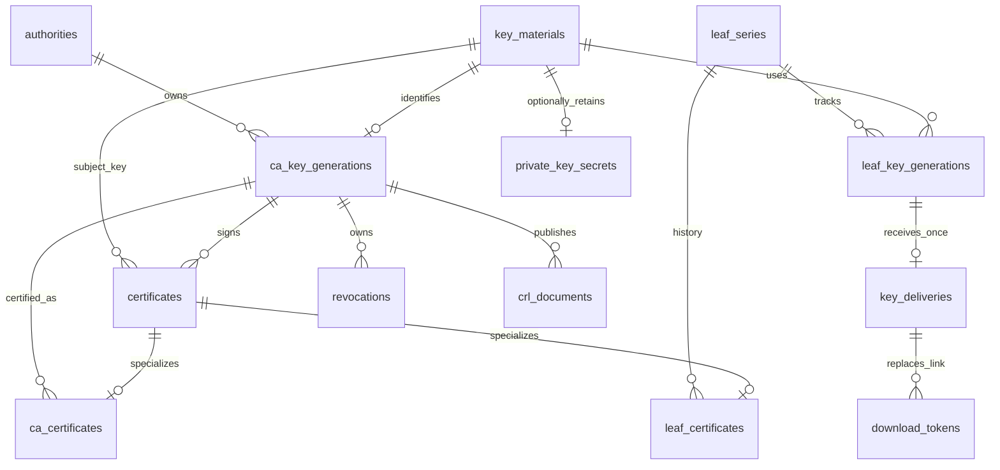

# 데이터 모델과 저장소 계약

## 범위와 표기

MVP 논리 모델이다. 제품 정책은 [운영·보안](./architecture.md), [수명·배포](./certificate-lifecycle.md), [import](./pki-import.md)를 따른다. 이 문서는 데이터의 소유 관계, 무결성, 영속 상태와 트랜잭션 경계를 정의한다. 실제 DDL·드라이버별 잠금 SQL은 구현 단계에서 이 계약에 맞춰 작성한다.

표에서 `PK`는 기본키, `FK`는 외래키, `UQ`는 유일 제약이다. 일반 엔터티에는 서버 생성 UUID `id`, UTC `created_at`을 둔다. 수정 가능한 집계 루트에는 `updated_at`, 낙관적 잠금용 정수 `version`을 둔다. 인증서·CRL 원본은 불변이고 운영 상태만 별도 수정한다.

- UUID는 소문자 표준 문자열 36자로 저장한다. 지문·토큰 해시는 SHA-256 소문자 hex 64자다. 식별자 비교는 DB 기본 collation에 맡기지 않고 동일한 바이트 비교 의미를 갖게 한다.
- 시간은 UTC Unix 마이크로초 정수, 기간은 단위가 명시된 정수로 저장한다. 인증서 DER의 시각은 원본 그대로 보존한다. 만료 여부는 현재 시각으로 계산하며 배치 작업이 상태를 바꿀 때까지 유효하다고 간주하지 않는다.
- 일련번호와 CRL 번호는 선행 0을 제거한 소문자 hex 문자열로 저장한다. 0은 `0`이며 인증서 신규 일련번호는 양수다. 숫자 크기 비교·증가는 Go의 큰 정수로 수행한다. SQL 문자열 정렬이나 BIGINT에 의존하지 않는다.
- 인증서·SPKI·CRL은 binary 데이터, 유연한 설정 스냅샷은 버전이 붙은 JSON 텍스트로 저장한다. JSON 내부 값에 FK·유일성·권한 검사를 의존하지 않는다.
- DB 고유 enum, 배열, 부분 유일 인덱스를 공통 모델의 필수 조건으로 삼지 않는다. 상태 값 검증은 서비스와 각 DB의 가능한 제약으로 보장한다. SQLite FK 활성화, 외부 DB 트랜잭션 지원을 필수로 한다.
- 비밀 원문, import 해제 암호, 다운로드 묶음, PKCS#12 암호는 저장하지 않는다.

## 핵심 관계

`authorities`는 관리 권한의 경계이며 인증서의 암호학적 발급자와 다르다. 정상·긴급 CA 교체는 새로운 authority를 만들고 전환 기록으로 연결한다. 향후 동일 CA의 교차 서명 인증서는 기존 authority·키 세대에 추가할 수 있지만 MVP 생성/import 경로에서는 거부한다.

`leaf_series`는 사용자가 계속 관리하는 논리적 인증서 항목이다. 갱신과 CA 전환에도 ID를 유지한다. 개별 인증서의 ID·발급자·일련번호는 바뀌며 기존 인증서를 덮어쓰지 않는다.

## 설치·관리자·인증

| 테이블 | 주요 필드·제약 | 의미 |
| --- | --- | --- |
| `installation` | 고정 PK=1, `setup_stage`, `first_admin_id` FK nullable, `active_encryption_generation_id` FK, `active_tls_version_id` FK nullable, `service_mode`, `version` | 최초 계정 생성, 설정 재개, 저장 키·HTTPS 활성 버전의 기준점 |
| `service_settings` | 고정 PK=1, `schema_version`, `settings_json`, `version`, `updated_by` FK | 서비스 URL, 발급 기본값, 수령·세션·CRL·감사 설정. 검증된 형식만 저장 |
| `accounts` | `login_name`, `normalized_login_name` UQ, `password_hash`, `state`, `auth_epoch`, `is_global_admin` | state=`active/reset_pending/disabled`. 비밀번호 해시는 Argon2id 파라미터 포함 |
| `sessions` | `token_hash` UQ, `account_id` FK, `auth_epoch`, `last_seen_at`, `absolute_expires_at`, `csrf_secret_hash` | 쿠키 원문 저장 금지. 계정 상태·epoch와 유휴/절대 만료 모두 검증 |
| `password_reset_tokens` | `token_hash` UQ, `account_id` FK, `auth_epoch`, `expires_at`, `consumed_at`, `invalidated_at` | GET 조회로 소비하지 않음. 발급 후 3시간 고정 |
| `auth_rate_limits` | `(kind, subject_hash, window_start)` UQ, `failure_count`, `blocked_until` | 계정/IP별 제한 상태. 원문 비밀번호·시도 입력 저장 금지 |

`setup_stage`는 `account_required → pki_required → complete`다. 첫 계정 생성은 installation 잠금 아래 계정 생성·first_admin 지정·단계 변경을 한 번에 커밋한다. HTTPS 부트스트랩 준비는 계정 생성 여부와 독립적이다.

MVP에서는 최초 전체 관리자 한 명만 생성한다. 미래 역할 테이블을 미리 빈 상태로 구현하지 않는다. 다만 권한 검사 인터페이스는 authority ID를 입력받고, 인증서의 issuer 경로만으로 권한을 부여하지 않는다.

## 공개키와 암호화된 개인키

| 테이블 | 주요 필드·제약 | 의미 |
| --- | --- | --- |
| `key_materials` | `spki_sha256` UQ, `spki_der`, `algorithm`, `parameters_json`, `origin`, `compromised_at` nullable | 개인키가 삭제돼도 남는 공개키 식별자. origin=`generated/imported` |
| `encryption_generations` | `id`, `activated_at`, `retired_at` nullable | 외부 저장 암호화 키의 세대 메타데이터. 원문 키 없음 |
| `private_key_secrets` | `key_material_id` PK/FK, `purpose`, `encryption_generation_id` FK, `format_version`, `nonce`, `ciphertext` | purpose=`ca_signing/leaf_delivery/internal_tls/bootstrap_ca`. 인증 태그 포함 암호문 |
| `encryption_verifier` | 고정 PK=1, `encryption_generation_id` FK, `format_version`, `nonce`, `ciphertext` | 개인키가 없는 DB도 주입 키 인증 복호화를 검사 |

AAD에는 테이블 구분·레코드 ID·용도·형식 버전을 모호하지 않은 고정 직렬화로 포함한다. rotate 시 모든 secret과 verifier를 새 nonce로 재암호화하고 세대 포인터를 같은 트랜잭션에서 변경한다.

키 하나의 저장 목적은 하나다. 일반 수령용 Leaf를 내부 HTTPS 보관용으로 전환해 수령 제한을 우회할 수 없다. 내부 HTTPS 발급은 시작부터 별도 계보·보관 목적을 사용한다. CA 키 파기나 수령 완료는 secret 행을 삭제하되 key_material·인증서·계보는 보존한다.

공개키 지문 UQ는 같은 공개키를 하나의 key_material로 표현한다는 뜻이다. `certificates.key_material_id`에는 UQ를 두지 않는다. 따라서 정상 갱신은 가능하다. import의 ‘다른 인증서인데 같은 공개키면 거부’는 별도 업무 검증이며, import 반영과 발급 커밋이 같은 공개키 단위로 직렬화되도록 한다.

## CA·인증서·갱신 계보

| 테이블 | 주요 필드·제약 | 의미 |
| --- | --- | --- |
| `authorities` | `kind`, `name`, `management_parent_id` FK nullable, `issuance_state`, `issuance_certificate_id` FK nullable, `archived_at` | kind=`root/intermediate/bootstrap`. 관리 소속은 발급자 경로와 별도. issuance_state=`inventory/enabled/stopped` |
| `ca_key_generations` | `authority_id` FK, `key_material_id` FK UQ, `generation_no`, `(authority_id,generation_no)` UQ, `key_destroyed_at` | CA 서명 키 세대 및 CRL·일련번호 이름공간 |
| `certificates` | `der_sha256` UQ, `der`, `key_material_id` FK, `issuer_ca_key_generation_id` FK, `serial_hex`, `(issuer_ca_key_generation_id,serial_hex)` UQ, `not_before`, `not_after`, `subject_json`, `extensions_json`, `origin`, `created_by` FK nullable | 서명된 불변 원본. 해석 필드는 검색용이며 DER가 원본 |
| `ca_certificates` | `certificate_id` PK/FK, `ca_key_generation_id` FK, `issuer_ca_certificate_id` FK nullable | 해당 CA 키를 인증하는 인증서. self-signed Root는 issuer 인증서 NULL, certificates의 issuer 키는 자기 CA 키 |
| `leaf_series` | `name`, `purpose`, `management_authority_id` FK, `current_certificate_id` FK nullable, `current_key_generation_id` FK nullable, `validity_policy_json`, `rotate_every`, `version`, `archived_at` | purpose=`distributed/internal_tls/bootstrap_tls`. rotate_every 기본 3, 1~100 |
| `leaf_key_generations` | `series_id` FK, `key_material_id` FK, `generation_no`, `(series_id,generation_no)` UQ, `renewal_count`, `prior_history_unknown`, `custody` | custody=`pending_delivery/client_held/internal`. import Leaf는 client_held, 이력 미상, count=0 |
| `leaf_certificates` | `certificate_id` PK/FK, `series_id` FK, `leaf_key_generation_id` FK, `issuer_ca_certificate_id` FK, `previous_certificate_id` FK nullable, `operation`, `renewal_count_at_issue`, `policy_snapshot_json` | operation=`initial/renew/rekey/migrate/emergency/import`. 당시 프로필·SAN·기간·교체 주기 보존 |
| `certificate_sans` | `(certificate_id,position)` PK, `type`, `normalized_value`, `normalized_value_hash` | 검색용 SAN. 원본은 DER, import의 지원 외 SAN도 원본에서 손실 없이 유지 |

certificates 한 행은 CA 또는 Leaf subtype 정확히 하나를 갖는다. issuer 키와 issuer 인증서의 CA 키가 일치해야 하며, Leaf subtype의 키 세대는 동일 series·공개키에 속해야 한다. 순환 FK가 생기는 Root·최초 Leaf는 포인터를 비운 부모 행부터 생성하고 같은 트랜잭션에서 완성한다. 중간 상태는 커밋하지 않는다.

authority의 issuance_certificate_id는 신규 발급에 선택한 자신의 CA 인증서를 가리킨다. enabled 전환 시 해당 인증서·키·인수 상태를 검증한다. CRL 발행에 사용하는 CA 인증서도 키 세대에 속한 유효 인증서로 명시적으로 선택하며, 기존 하위 인증서의 issuer_ca_certificate_id는 이 포인터 변경으로 바뀌지 않는다.

관리 parent는 MVP에서 Root→Intermediate만 허용하고 루프를 거부한다. bootstrap은 일반 CA 목록·발급·import 대상에서 제외한다. 일반 Leaf issuer는 Intermediate, bootstrap_tls만 bootstrap issuer를 허용한다. 외부 HTTPS 스냅샷은 아래 별도 모델이므로 외부 체인을 일반 PKI import로 강제하지 않는다.

유효기간은 연/월/일 의미를 잃지 않는 버전형 정책으로 저장한다. 기본 1년은 발급 기준 UTC 시각의 달력상 1년 뒤이며 존재하지 않는 날짜는 대상 월 말일로 맞춘다. 최종 notBefore/notAfter와 사용한 정책은 인증서마다 고정한다. CA 만료 초과는 거부한다.

`current_certificate_id`는 마지막 발급 결과이며 외부 설치 완료를 뜻하지 않는다. 새 키 수령 실패 후 이전 키 세대를 자동으로 current로 되돌리지 않는다. 관리자는 새 키 재발급을 실행한다. 만료·개별 폐기·CA 유출 영향·수령 상태·발급 중지는 하나의 status enum으로 합치지 않고 각각 조회한다.

## 일회성 수령·공개 다운로드

| 테이블 | 주요 필드·제약 | 의미 |
| --- | --- | --- |
| `key_deliveries` | `leaf_key_generation_id` FK UQ, `certificate_id` FK UQ, `expires_at`, `state`, `consumed_at`, `finished_at`, `failure_code`, `version` | 새 키에 한 번 생성. state=`pending/transferring/server_completed/failed/expired` |
| `download_tokens` | `token_hash` UQ, `purpose`, `certificate_id` FK, `key_delivery_id` FK nullable, `expires_at`, `consumed_at`, `invalidated_at`, `created_by` FK | purpose=`leaf_public/leaf_private`. private는 delivery 필수, public은 NULL |

개인키는 certificate→leaf generation→key_material→secret으로 찾는다. delivery가 pending일 때만 수령용 secret이 존재하며 transferring으로 커밋할 때 삭제한다. 내부 TLS와 CA에 delivery 생성은 금지한다.

대시보드 인증 수령도 동일 delivery를 소비한다. 토큰을 사용한 경우 토큰까지 함께 소비하고, 다른 남은 private 토큰은 모두 무효화한다. 링크 교체는 delivery를 잠근 뒤 pending·미만료를 확인하고 기존 미사용 토큰 무효화와 새 토큰 저장을 원자적으로 수행한다. private 토큰 기한은 delivery 기한을 넘지 못한다. public 링크 교체는 대상 인증서를 잠근다.

응답 생성은 메모리에서 수행한다. 소비 커밋 직전 잠금 아래 상태·기한·토큰을 다시 검증한다. 오직 커밋 승자만 응답을 전송하며 패자는 준비한 키·묶음 참조를 폐기한다. 커밋 결과가 불명확하면 전송하지 않고 DB 상태를 확인한다. 소비한 권한을 되살리지 않는다.

전송 성공 기록은 `server_completed`만 뜻한다. 실패 또는 재시작 시 남은 transferring은 failed로 처리하고 폐기·CRL 작업을 같은 트랜잭션에 기록한다. server_completed 이후 관리자 저장 실패 신고도 failed 및 폐기로 전환할 수 있다. pending 상태로 되돌리는 전이는 없다.

## 폐기·CRL·기존 PKI 인수

| 테이블 | 주요 필드·제약 | 의미 |
| --- | --- | --- |
| `revocations` | `issuer_ca_key_generation_id` FK, `serial_hex`, 두 필드 UQ, `certificate_id` FK nullable, `revoked_at`, `reason`, `source`, `change_generation` | 인증서 없는 CRL 항목도 보존. certificate 연결 시 발급 키·일련번호 일치 필수 |
| `revocation_revisions` | `revocation_id` FK, `revision_no`, 두 필드 UQ, `previous_values_json`, `new_values_json`, `justification`, `actor_id` FK nullable, `source_import_id` FK nullable | 폐기 정정 근거를 감사 보존 기간과 무관하게 보존. 폐기 해제 불가 |
| `crl_states` | `ca_key_generation_id` PK/FK, `max_reserved_number_hex`, `revocation_generation`, `published_crl_id` FK nullable, `next_publish_at`, `publication_state`, `signing_ca_certificate_id` FK nullable, `version` | 번호 상한에는 import·운영자 복원 상한 포함. publication_state=`inactive/active/closed` |
| `crl_documents` | `ca_key_generation_id` FK, `number_hex` nullable, `der_sha256` UQ, `der`, `this_update`, `next_update` nullable, `covered_generation` nullable, `origin`, `source_import_id` FK nullable | 서명된 불변 CRL 원본. origin=`generated/imported`. 생성본은 번호·nextUpdate·covered_generation 필수 |
| `ca_takeovers` | `ca_key_generation_id` FK, `state`, `history_assertion`, `previous_max_number_hex`, `external_issuer_stopped_at`, `confirmed_by` FK nullable, `confirmed_at`, `evidence_json` | state=`pending/confirmed`. 기존 폐기 없음·CRL 제공·과거 발급 자료 확인을 명시 기록 |
| `import_batches` | `requested_by` FK, `input_manifest_json`, `state`, `committed_at`, `result_json` | 파일 지문과 공개 자료 참조·결과만 보존. 개인키·해제 암호 저장 금지 |

CRL의 서명자 단위는 authority 전체가 아닌 CA 키 세대다. 기존 ‘CA별 번호’는 이 서명자 이름공간으로 구체화한다. CA 인증서의 고정 CRL URL은 그 키 세대의 published_crl을 참조한다. CA 교체는 새 키 이름공간을 만들고 이전 URL을 유지한다.

import 원본은 같은 번호라도 서로 다른 DER일 수 있으므로 crl_documents의 `(CA 키,번호)`에는 전역 UQ를 두지 않는다. 충돌 원본을 보존할 수 있지만 새 발행은 crl_states에서 예약한 유일한 번호만 사용한다. 원본 보관이 게시 승격을 의미하지 않으며 최초 운영 CRL은 인수 확인 후 병합 이력으로 새로 생성한다.

폐기 변경 시 issuer 상태 행을 잠가 generation을 증가시키고 폐기와 작업 큐를 함께 커밋한다. CRL 생성은 동일 잠금 아래 번호 예약·폐기 목록 스냅샷·generation 캡처를 묶고, 트랜잭션 밖에서 서명한다. 번호가 클수록 더 오래된 스냅샷을 사용하지 않게 한다. 완성본 게시 시 번호와 covered_generation 모두 후퇴하지 않아야 한다. 미반영 generation이 있으면 후속 작업을 유지한다.

인증서 import 시 기존 issuer/serial 폐기 항목이 있으면 같은 트랜잭션에서 certificate_id를 연결하며 해당 인증서를 폐기 상태로 조회한다. 등록 인증서가 있어도 폐기의 기준 키는 issuer/serial이고 연결 여부가 효력에 영향을 주지 않는다.

만료 인증서 폐기 항목도 MVP에서는 제거하지 않는다. 최종 CRL 조건은 실제 하위 인증서 기간과 CRL 정책으로 검사하며 publication_state=closed는 이를 만족할 때만 허용한다. CA 키 존재·파기 여부, 인수 확인, 유효성, 발급 중지 여부는 각각 따로 판단한다. 발급 중지로 CRL 서명까지 자동 금지하지 않는다.

## 전환·외부 배포 확인

| 테이블 | 주요 필드·제약 | 의미 |
| --- | --- | --- |
| `ca_transitions` | `source_authority_id` FK, `target_authority_id` FK nullable, `mode`, `state`, `reported_by` FK, `reported_at`, `reason` | mode=`normal/emergency`. 긴급 신고 시 후속 CA가 없어도 등록 가능 |
| `transition_impacts` | `(transition_id,certificate_id)` PK/FK, `replacement_certificate_id` FK nullable, `reissued_at` | CA 영향과 개별 폐기를 구분. 실패한 대체 발급은 인증서 계보에 남고 성공 대상 포인터 갱신 |
| `deployment_confirmations` | `transition_id` FK, `certificate_id` FK nullable, `target_label`, `action`, `confirmed_by` FK nullable, `confirmed_at` nullable | 관리자가 등록한 대상별 신뢰 추가·인증서/키 교체·기존 신뢰 제거 확인 |

외부 장비를 탐색하거나 설치 성공을 추정하지 않는다. target_label은 수동 관리 대상이며 에이전트·장비 인벤토리 기능을 전제하지 않는다. 정상 Root 전환의 후속 Intermediate 매핑은 각 Intermediate 전환 행으로 표현한다.

긴급 신고 트랜잭션은 source 및 관리 하위 CA 발급을 차단하고 영향 목록을 기록한다. Leaf 재발급 시 issuer 체인의 차단 여부도 다시 검사한다. key_material.compromised_at은 실제 해당 키 유출에만 설정하며 상위 CA 영향만으로 Leaf 개인키가 유출됐다고 기록하지 않는다.

## 내부 HTTPS·유지보수·작업·감사

| 테이블 | 주요 필드·제약 | 의미 |
| --- | --- | --- |
| `tls_versions` | `source`, `key_material_id` FK, `managed_certificate_id` FK nullable, `leaf_der`, `chain_bundle`, `validated_service_url`, `not_after` | 검증 완료한 내부 스냅샷. source=`bootstrap/managed/external`. 외부 입력은 일반 PKI 중복 import 검사 대상 아님 |
| `tls_changes` | `previous_version_id` FK nullable, `candidate_version_id` FK, `phase`, `error_code` | phase=`prepared/committed/applied/rolled_back/recovery_required`. 활성 포인터와 함께 복구 판단 |
| `maintenance_runs` | `kind`, `phase`, `details_json`, `started_at`, `completed_at`, `error_code` | rotate·restore-finalize·bootstrap 재생성의 단계 기록. 비밀 입력 없음 |
| `maintenance_crl_requirements` | `(maintenance_run_id,ca_key_generation_id)` PK/FK, `minimum_generation`, `minimum_number_hex`, `satisfied_crl_id` FK nullable | 복구 서비스 재개를 막는 실제 CRL 대상·충족 증거 |
| `operation_requests` | `(actor_key,operation,request_id)` UQ, `input_hash`, `state`, `result_certificate_id` FK nullable, `result_json` | 발급·갱신·재발급 재시도 결과. 결과에 토큰 원문·개인키 포함 금지 |
| `jobs` | `kind`, `dedup_key` UQ, `payload_version`, `payload_json`, `state`, `available_at`, `lease_until`, `attempt_count`, `last_error_code` | 영속 작업 큐. CRL 발행·수령 만료·복구 정리 등. 원문 비밀 없음 |
| `audit_events` | `occurred_at`, `actor_kind`, `actor_id` nullable, `token_id` nullable, `action`, `target_type`, `target_id`, `client_ip`, `result`, `details_json` | append-only 업무 감사. CLI/system actor 구분. 토큰 삭제 뒤에도 식별 메타데이터 보존 |
| `audit_event_scopes` | `(event_id,authority_id)` PK/FK | 복수 CA 작업의 관련 범위. 장기 조회는 모든 범위 권한 필요 |

TLS 스냅샷은 active·교체 진행·롤백 후보가 참조하는 키를 유지한다. 완료 후 bootstrap 키는 삭제하되 공개 스냅샷·교체 기록은 보존한다. 따라서 과거 tls_version에 key_material이 있어도 secret이 있다고 가정하지 않는다. 재시작 복구는 완료 여부에 맞는 활성 버전만 사용한다.

operation_requests의 성공 결과는 인증서 운영 이력과 함께 보존하여 오래된 요청 ID도 새 발급으로 해석하지 않는다. 중복 응답은 기존 인증서·수령 상태를 돌려주며 분실한 링크는 별도 토큰 교체 작업으로 해결한다. 서명 실패로 롤백한 요청의 재시도는 가능하다. 입력 해시는 정규화한 작업 입력에 대해 계산한다. actor_key는 계정 ID 또는 명시적 system/CLI 식별자이며 표시 이름 변경에 영향을 받지 않는다.

jobs는 최소 한 번 실행을 전제로 하고 업무별 멱등성을 갖는다. 작업 완료 시 같은 dedup_key에 새 작업 요구가 들어왔는지 generation/version을 검사하고 그 요구까지 삭제하지 않는다. 실행 임대 만료는 재시도 근거이며 개인키 수령 권한을 복원하는 근거가 아니다.

업무 상태 변경과 성공 감사 이벤트는 같은 트랜잭션으로 기록한다. 다운로드 시작 감사는 소비 커밋에, 전송 결과는 별도 커밋에 기록한다. 감사 행은 업무 데이터의 FK 부모로 사용하지 않는다. 보존 기간 정리 시 scopes도 함께 삭제할 수 있지만 폐기 정정·전환·인수 이력은 남는다.

## 필수 트랜잭션과 동시성

| 작업 | 함께 보장할 데이터 변경 |
| --- | --- |
| 비밀번호 재설정 시작 | 계정 잠금 → reset_pending·auth_epoch 증가 → 모든 세션 삭제 → 기존 재설정 링크 무효화 → 새 링크·감사 |
| 비밀번호 변경 완료 | 계정·토큰 잠금 및 기한 검증 → 비밀번호 변경·active·epoch 증가 → 모든 세션 삭제·모든 재설정 링크 무효화 → 감사 |
| 발급·갱신·재발급 | 요청 ID·계보·관련 CA 상태 확인 → 공개키/인증서/계보·횟수·필요시 secret/delivery 생성 → 결과 저장·감사 |
| 개인키 소비 | delivery·토큰 재검증 → transferring·토큰 무효화·secret 삭제·시작 감사 → 커밋 후 전송 |
| 수령 실패·만료 | delivery 종료·secret 삭제·토큰 무효화 → 폐기 추가·generation 증가·CRL 작업·감사 |
| import 반영 | 현재 공개키·DER·issuer/serial 중복 재검사 → CA/인증서/폐기/인수 기록·작업·결과·감사 일괄 커밋 |
| CRL 게시 | 완성본 저장 → 현재 번호·generation과 비교 → published 포인터·다음 시각 갱신 또는 구본 게시 거부 |
| rotate | 모든 secret·verifier 재암호화 → 활성 암호화 세대·실행 결과·감사 일괄 커밋 |
| restore-finalize 정리 | 토큰 무효화·세션 삭제·대기/전송 중 키 삭제·폐기 → CRL 요구·작업·복구 단계 저장 |

일련번호 신규 할당은 issuer의 crl_states 행을 직렬화 지점으로 사용해 certificates와 revocations 양쪽에서 충돌을 확인한다. 아직 crl_states가 없는 CA는 동일 생성 트랜잭션에서 먼저 만든다. 동일 공개키로 동시 import하는 경우 key_material UQ 충돌을 재조회한 뒤 정책을 다시 검사한다.

네 DB 모두에서 같은 결과를 보장한다. SQLite는 쓰기 트랜잭션 획득, PostgreSQL/MySQL/MariaDB는 행 잠금과 유일 제약을 조합한다. 잠금 순서는 구현 전체에서 공통 순서로 정의하고 복수 CA·계보는 ID 정렬 순서로 잡는다. deadlock/쓰기 경합은 제한 재시도하되, 응답 전송 같은 외부 효과를 시작한 작업은 전체 재실행하지 않는다.

서명·패키징을 트랜잭션 밖에서 수행하는 경우 입력 version을 캡처하고 커밋 시 issuer 차단·유효성·계보 current·횟수를 다시 검사한다. 검증이 바뀌면 서명 결과를 버리고 재검증한다. 커밋 전 인증서·개인키를 외부에 노출하지 않는다.

서비스와 오프라인 CLI의 배타 실행 잠금은 jobs 임대나 단순 DB 플래그로 대체하지 않는다. DB별 연결 수명 잠금 또는 동등한 배타 제어를 구현하고, 소유권 상실 시 서비스가 쓰기·서명·전송을 계속하지 않도록 한다. 전용 writer 연결과 DB별 배타 실행 방식은 [DB·마이그레이션 설계](./storage-migrations.md)를 따른다.

## 인덱스·삭제·검증

UQ·FK 외에 다음 조회 인덱스를 둔다. 지원 DB별 실행 계획을 보고 불필요한 중복 인덱스는 제거한다.

- 인증서: `(not_after,id)`, `(issuer_ca_key_generation_id,not_after)`, `(key_material_id,id)`; Leaf 이력 `(series_id,created_at)`; SAN `(type,normalized_value_hash)`와 원문 재검사.
- 수령·토큰: `(state,expires_at)`, `(key_delivery_id,invalidated_at)`, `(certificate_id,purpose,invalidated_at)`.
- 세션·재설정: `(account_id,expires_at)`에 해당하는 각 만료 필드; 세션은 absolute_expires_at 사용.
- 작업: `(state,available_at)`; 감사: `(occurred_at,id)`, `(actor_id,occurred_at)`, `(client_ip,occurred_at)`, scopes `(authority_id,event_id)`.
- CRL: `(ca_key_generation_id,created_at)`; 폐기: issuer/serial UQ와 `(certificate_id)`.

PKI 참조에는 원칙적으로 ON DELETE RESTRICT를 사용한다. secret·세션·소비/만료 토큰·완료 작업은 목적에 맞게 정리할 수 있지만 인증서·공개키·CA·계보·폐기·정정·전환·성공 발급 요청 결과는 일반 삭제하지 않는다. expired/consumed 토큰 삭제 후에도 audit에는 원문 없는 토큰 ID가 남을 수 있다.

구현 검증은 [검증 기준](./planning.md)에 더해 다음을 포함한다.

1. 동일 키 갱신은 새 인증서 행을 만들되 import는 같은 공개키의 다른 인증서를 거부한다.
2. CA 교체에도 기존 Leaf 계보·키 횟수·기존 CRL URL을 유지한다.
3. DB별 동시 갱신·수령·import·폐기/CRL 경쟁에서 유일성·직렬화·게시 세대가 유지된다.
4. 각 커밋 전후 프로세스 종료 후 토큰 소비·수령 실패·rotate·TLS 교체·복구를 안전하게 재개한다.
5. 인증서 없는 폐기 항목, 큰 CRL 번호, 계정 reset_pending, 개인키 없는 공개키 이력이 손실 없이 유지된다.
6. 잘못된 subtype·다른 series 키 세대·불일치 issuer·내부 TLS의 delivery 생성은 저장소 계약에서 거부한다.

장기 ACME 계정·order·authorization·challenge, CA 역할·태그 ACL, 교차 서명 경로 선택, OCSP 캐시는 이번 테이블에 억지로 포함하지 않는다. 기존 ID·키 세대·issuer 관계를 확장하는 별도 마이그레이션으로 추가한다.

## 보안 검토 반영 저장 계약

import_batches.input_manifest_json은 API ImportManifest v1의 서버 재구성 결과만 저장한다. result_json은 ImportResult의 공개 결과 필드만 저장하고 ca_takeovers.evidence_json은 TakeoverEvidence v1만 저장한다. 스키마 버전별 허용 필드 외 값은 거부하며 입력 metadata 전체를 JSON 컬럼에 넘기지 않는다. 별도 SQL 컬럼 추가는 필요하지 않다.

개인키 전송 후 완료/실패 기록이 미확정이면 runtime이 즉시 일반 요청을 닫고 종료한다. 다음 시작 시 transferring을 failed·폐기·CRL 작업·감사와 원자적으로 정리한 뒤 요청을 연다. MVP는 실행 중 lease 회수나 attempt 테이블을 추가하지 않는다. 완료 후처리 commit이 실제로 성공한 경우 재시작은 저장된 server_completed를 유지한다. 실패 상태를 되돌리는 늦은 callback을 허용하지 않는다.

revocation의 certificate_id가 있으면 issuer_ca_key_generation_id·serial_hex가 해당 인증서와 일치해야 하며 certificate_id 없는 과거 CRL 항목은 허용한다. delivery의 certificate·Leaf key generation·key material의 일치도 같은 writer 트랜잭션에서 검증한다. 네 저장 어댑터 모두 불일치 삽입의 전체 rollback을 계약 테스트한다. 서비스가 검증한 공개 DTO와 명시적 repository 경로를 사용하며 임의 row 쓰기 API를 제공하지 않는다.
