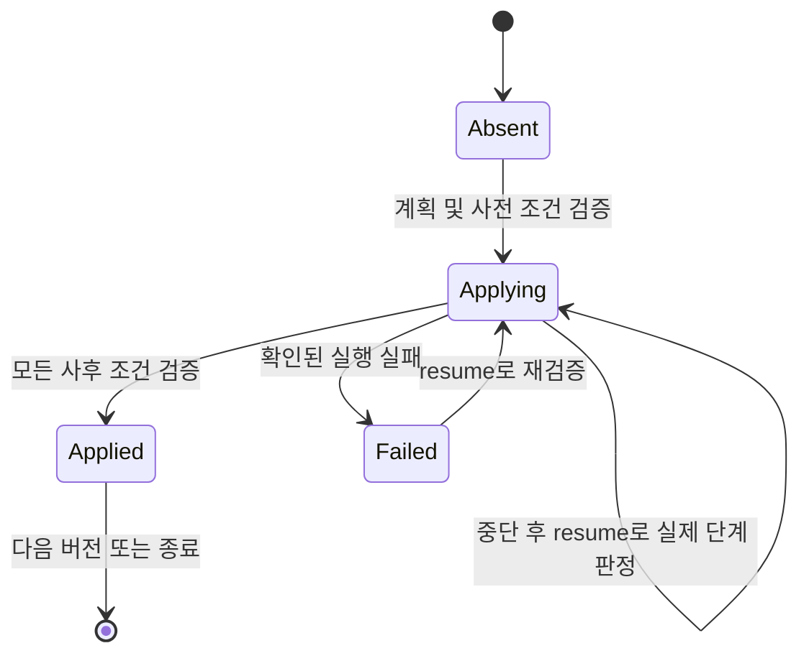

# DB 저장소와 마이그레이션 설계

[데이터 모델](./data-model.md)의 논리 제약을 네 DB에 구현하기 위한 계약이다. 초기 SQL 파일과 고정 버전은 [실행 아티팩트](./dependencies.md)에 연결했다. SQLite 초기 스키마는 실행 검증했으며 외부 DB·운영 실행기의 검증 완료를 뜻하지 않는다.

## 문서의 적용 시점

백엔드 객체·서비스·인터페이스 설계를 먼저 진행한다. 이 문서는 이후 저장소 어댑터를 구현할 때 사용할 제약과 복구 참고 자료이며, 마이그레이션 구현을 다음 최우선 작업으로 지정하지 않는다.

## 저장소 경계

아래 작업명은 저장 원자성의 범위를 나타낸다. 발급 계획·키 생성·서명·권한 판단은 애플리케이션/도메인 책임이며 저장소가 수행하지 않는다. 정확한 저장 계약은 [백엔드 구현 설계](./backend-implementation.md)의 UnitOfWork/TxStores를 따른다. 서비스가 트랜잭션을 열고 repository는 그 안에서만 동작한다. 서비스에는 CRUD 테이블 저장소 대신 `IssueCertificate`, `RenewLeaf`, `ConsumeDelivery`, `FailDelivery`, `ImportPKI`, `RevokeCertificate`, `ReserveCRL`, `PublishCRL`, `BeginPasswordReset`, `CompletePasswordReset`, `RotateSecrets` 같은 업무 단위 인터페이스를 노출한다. 서비스가 여러 저장소를 호출하며 트랜잭션을 누락하지 않도록 동일 UnitOfWork를 강제한다.

조회 모델은 인증서·수령·폐기·영향·발급 상태를 조합하지만 저장된 DER를 다시 쓰지 않는다. Go 오류는 not_found/conflict/version_conflict/retryable/unavailable로 정규화하고 SQL 오류 문자열·DSN을 API에 전달하지 않는다.

MVP는 낮은 처리량과 단일 인스턴스를 전제로 **변경 트랜잭션을 프로세스 내 한 writer 경로로 직렬화**한다. 읽기는 별도 풀을 사용할 수 있다. 암호화·서명·응답 포맷 변환은 가능하면 writer 밖에서 처리하고 커밋 직전에 version·기한·권한을 다시 검사한다. 이 단순화에도 DB 유일 제약·조건부 갱신·트랜잭션 테스트는 유지한다.

## 물리 타입과 인덱스

| 논리 값 | SQLite | PostgreSQL | MySQL / MariaDB |
| --- | --- | --- | --- |
| UUID·고정 hex | TEXT, 길이 검사 | VARCHAR(n), 길이 검사 | VARCHAR(n), ASCII binary collation |
| UTC 마이크로초·카운터 | INTEGER | BIGINT | BIGINT signed |
| 논리 bool | INTEGER 0/1 | BOOLEAN | BOOLEAN 및 0/1 입력 검증 |
| DER·암호문·SPKI | BLOB | BYTEA | LONGBLOB |
| JSON 스냅샷·설정 | TEXT | TEXT | LONGTEXT |
| 사용자 표시 문자열 | TEXT | TEXT | utf8mb4 TEXT |

UUID·지문·정규화 계정 이름은 DB별 비교 결과가 같도록 저장소에서 정규화한다. 로그인 이름은 MVP에서 ASCII 영문·숫자·`._-`, 3~64자로 제한하고 소문자로 유일성 검사한다. 표시 이름과 혼동하지 않는다. 사용자 문자열은 길이 제한을 서비스 계약으로 검증한다.

일련번호는 신규 발급 기준 최대 40 hex 자리다. import도 지원 가능한 양의 20옥텟 이하 일련번호로 검증한다. CRL 번호는 비음수 최대 20옥텟으로 제한한다. 길이를 넘는 입력은 자르거나 정수 overflow시키지 않고 unsupported_import로 거부한다.

SAN과 긴 문자열 전체에 무제한 인덱스를 만들지 않는다. SAN 검색에는 `normalized_value_hash` 고정 64자 필드를 추가해 `(type,normalized_value_hash)`로 후보를 찾고 원문을 다시 비교한다. 로그인·상태·작업키 등 인덱스 대상은 길이가 정해진 VARCHAR로 매핑한다. 작업 dedup_key 최대 128 ASCII자, request_id UUID, actor_key 최대 64 ASCII자다.

이진 필드와 JSON의 최대 크기는 API 입력 제한 및 파서 검증을 따른다. 각 JSON에는 schema_version을 두고 unknown version을 임의 해석하지 않는다. MySQL/MariaDB 테이블은 InnoDB로 생성한다. FK 대상과 참조 필드는 같은 타입·collation을 사용한다.

## 실행 잠금과 트랜잭션

| DB | 실행 전체 배타 잠금 | 업무 트랜잭션 |
| --- | --- | --- |
| SQLite | DB가 위치한 동일 로컬 볼륨의 고정 lock 파일에 OS 배타 잠금. PID 파일만으로 판정하지 않음 | 전용 writer 연결의 BEGIN IMMEDIATE; FK 활성화·busy timeout 설정 |
| PostgreSQL | 전용 writer 연결에서 DB별 고정 키의 session advisory lock 획득 | READ COMMITTED + 필요한 SELECT FOR UPDATE·UQ·version 조건 |
| MySQL / MariaDB | 전용 writer 연결에서 DB 이름을 포함한 고정 이름의 GET_LOCK(name,0), 반환 1 확인 | InnoDB READ COMMITTED + SELECT FOR UPDATE·UQ·version 조건 |

PostgreSQL session advisory lock은 세션 종료까지 유지되고 transaction rollback과 별개다. SQLite BEGIN IMMEDIATE는 먼저 쓰기 트랜잭션을 확보하며 기존 writer가 있으면 busy가 발생할 수 있다. [PostgreSQL 잠금 문서](https://www.postgresql.org/docs/current/explicit-locking.html), [SQLite 트랜잭션 문서](https://www.sqlite.org/lang_transaction.html).

MySQL/MariaDB 잠금 이름은 정규화한 DB 이름의 해시를 포함한 64자 이하 고정 문자열로 만든다. 잠금은 commit/rollback으로 해제되지 않고 명시적 해제 또는 세션 종료로 해제된다. [MySQL GET_LOCK](https://dev.mysql.com/doc/refman/8.4/en/locking-functions.html), [MariaDB GET_LOCK](https://mariadb.com/docs/server/reference/sql-functions/secondary-functions/miscellaneous-functions/get_lock).

잠금을 보유한 연결은 풀에 반환하지 않고 그 연결로 모든 변경 트랜잭션을 수행한다. 연결 교체·자동 재연결로 잠금 없이 작업을 이어가지 않는다. DB 연결을 잃으면 writer를 닫고 요청·작업을 중단한 뒤 프로세스를 종료한다. 새 실행은 새 잠금·저장 키·복구 검증을 통과해야 한다. 잠금 이름을 임의 설정해 같은 DB에 두 서비스를 실행하는 구성은 지원하지 않는다.

이 구조는 잠금 확인용 연결만 끊겼는데 다른 연결에서 계속 쓰는 문제를 피하기 위한 선택이다. 읽기 결과로 서명·키 전송을 승인하지 않고 writer에서 최종 소비·상태 변경을 커밋해야 한다. 이미 커밋하여 전송 중인 응답을 외부 프로세스가 취소할 수 있다고 보장하지는 않는다. 정상 유지보수 진입은 신규 요청 중지 → 기존 전송 종료 대기 → writer 종료 → 잠금 해제 순서다. 강제 중단은 transferring 복구 정책을 따른다.

SQLite DB·lock 파일은 동일 호스트의 안정적인 로컬 볼륨에 둔다. 네트워크 파일시스템·서로 다른 lock 파일로 같은 DB 접근은 지원하지 않는다. lock 파일은 잠금 해제 시 삭제하지 않아 inode 교체 경쟁을 피한다. 외부 DB도 프록시가 session 단위 잠금 연결을 보존해야 하며 transaction pooling을 사용하지 않는다.

잠금 순서는 writer → 계정/설치 → 요청 ID → authority(ID 정렬) → Leaf 계보(ID 정렬) → 공개키 → crl_states → 인증서 → delivery → token → job으로 고정한다. 필요한 대상은 사전 조회 후 이 순서로 잠그고 관계를 재검증한다. 데드락·busy는 외부 효과 전일 때만 최대 3회 제한 재시도하고 이후 503을 반환한다.

성공 요청 ID 조회는 If-Match 검사보다 먼저 수행한다. 계정 인증·권한 검사는 항상 먼저다. 커밋 결과가 불명확하면 새 ID로 다시 발급하지 않고 같은 요청 ID로 결과를 확인한다. 개인키 소비는 결과 조회 후에도 소비된 권한으로 전송을 재개하지 않는다.

## 마이그레이션 실행

`cert-me db migrate`는 오프라인 실행 잠금을 획득한 뒤 마이그레이션을 수행한다. 빈 DB에 대한 최초 스키마 생성만 최초 서버 시작에서 같은 실행 경로로 자동 수행한다. 기존 DB 버전이 다르면 서버는 HTTP를 열지 않고 필요한 migrate 명령을 안내한다. 구버전 바이너리가 신버전 DB를 열어 쓰는 것도 거부한다.

`schema_migrations`에는 version PK, name, checksum, state(applying/applied/failed), started_at, completed_at, last_step, error_code를 둔다. DB별 동일 논리 버전은 서로 다른 SQL 파일과 체크섬을 갖는다. 적용 완료 파일을 수정하지 않으며 새 마이그레이션을 추가한다. 서버는 버전뿐 아니라 체크섬·failed/applying 상태를 검사한다.

MVP 마이그레이션은 다음 논리 묶음으로 작성한다. `installation`과 상태 테이블의 순환 참조는 아래 FK 처리 절차를 따른다.

| 버전 | 생성 대상과 목적 |
| --- | --- |
| 001 identity | accounts, sessions, password_reset_tokens, auth_rate_limits, service_settings |
| 002 keys | key_materials, encryption_generations, private_key_secrets, encryption_verifier |
| 003 pki | authorities, ca_key_generations, certificates, ca_certificates, leaf_series, leaf_key_generations, leaf_certificates, certificate_sans |
| 004 delivery | key_deliveries, download_tokens, operation_requests |
| 005 revocation | import_batches, revocations, revocation_revisions, ca_takeovers, crl_states, crl_documents |
| 006 operations | ca_transitions, transition_impacts, deployment_confirmations, tls_versions, tls_changes, maintenance_runs, maintenance_crl_requirements, jobs |
| 007 installation_audit | installation, audit_events, audit_event_scopes, 미완성 FK·조회 인덱스·전체 무결성 검사 |

위 버전은 애플리케이션 릴리스 버전과 별개다. 모두 완료돼야 MVP 스키마로 서비스 가능하다. schema_migrations는 실행기가 먼저 생성한다. 빈 DB 스키마 생성만으로 관리자나 Root를 만들지 않는다. 저장 키 verifier·installation·기본 설정 데이터는 모든 스키마가 준비된 뒤 별도 원자적 초기화로 만든다.

### 순환 FK 처리

PostgreSQL/MySQL/MariaDB는 해당 묶음의 기본 테이블부터 생성한 뒤 FK를 추가한다. 아직 없는 다른 묶음의 대상은 007에서 추가한다. nullable 포인터는 DML의 최초 행 생성 시만 비워두며 실제 리소스 생성 트랜잭션 완료 시 모델의 불변식을 검사한다.

SQLite는 최초 CREATE TABLE에 FK 선언을 포함하고 모든 참조 테이블 생성 이후 foreign_key_check를 수행한다. 실제 행 입력은 전체 생성 뒤에 시작한다. 후속 스키마 변경에서 테이블 재구성이 필요하면 copy → 개수/값/참조 검증 → 교체를 수행하고 FK 검사를 통과한 경우만 완료한다. 연결별 foreign_keys 설정 변경은 트랜잭션 경계와 드라이버 동작을 테스트한다. FK를 끈 상태로 일반 서비스를 시작하지 않는다. [SQLite FK 문서](https://www.sqlite.org/foreignkeys.html)의 연결별 활성화·스키마 변경 제약을 따른다.

### 실패와 재개

MySQL/MariaDB의 DDL은 암묵적 commit을 일으킬 수 있으므로 migration 전체를 단일 rollback으로 되돌린다고 가정하지 않는다. [MySQL DDL commit 문서](https://dev.mysql.com/doc/refman/8.4/en/implicit-commit.html), [MariaDB implicit commit 문서](https://mariadb.com/docs/server/reference/sql-statements/transactions/sql-statements-that-cause-an-implicit-commit).

각 DDL 단계는 실행 전 기대 스키마, 실행 후 실제 테이블·컬럼·인덱스·FK를 검사한다. 단계 적용 후 last_step 기록 전에 죽어도 실제 스키마를 비교해 적용 완료를 인정할 수 있어야 한다. `IF NOT EXISTS`만으로 이름이 같고 정의가 다른 테이블을 성공 처리하지 않는다. 예상 정의와 다르면 중지한다.

자동 파괴적 down migration은 제공하지 않는다. 실패한 단계는 전용 재개 명령이 체크섬·실제 스키마·데이터 조건을 검사한 뒤 이어간다. 데이터 손실 없이 재개 불가능하면 실패 상태를 유지하고 수정 마이그레이션 또는 운영자 복구가 필요하다. 백업 실행·보관을 cert-me가 대신하지 않는다.

PostgreSQL/SQLite에서 가능한 DDL은 버전 단위 트랜잭션으로 묶지만 동일 중단·재개 검증을 수행한다. 적용 완료 후 인덱스·FK·필수 singleton·모델 제약 검사 및 버전 갱신을 마친 뒤 서비스 시작을 허용한다.

## DDL로만 보장할 수 없는 제약

DB에서는 PK/UQ/FK/NOT NULL과 가능한 CHECK를 사용한다. 다음은 업무 저장소를 통한 쓰기 및 계약 테스트로 보장한다.

- certificates의 CA/Leaf subtype 정확히 하나, issuer 키와 issuer 인증서 일치.
- leaf_series current 포인터·generation·공개키의 소속 일치.
- 일반 Leaf Root 직접 발급 금지 및 bootstrap 격리.
- import 공개키 중복 거부와 정상 갱신 공개키 재사용 허용.
- 수령 상태 전이와 secret 존재 여부, CA·내부 TLS의 수령 권한 생성 금지.
- CRL 번호 큰 정수 비교·generation 후퇴 방지, revocations와 certificates 사이 일련번호 충돌 검사.
- CA 인수 확인·유효성·키 존재 여부·발급 차단과 권한 검사.

복구용 직접 SQL 편집을 정상 운영 API로 취급하지 않는다. 정합성 검사에서 실패하면 일반 서비스는 열리지 않고 구체적인 대상 ID와 위반 규칙만 출력한다. 키·토큰 원문은 출력하지 않는다.

## 구현 완료 조건

네 DB에 각각 빈 DB 설치, 동일 버전 재실행, 이전 버전 업그레이드, 잘못된 체크섬·새 버전 거부, DDL 단계별 강제 중단·재개를 검증한다. MySQL과 MariaDB는 별도 CI job이다.

공통 저장소 테스트는 동시 첫 관리자 생성·개인키 수령·갱신·같은 요청 ID·중복 import·CRL 예약/게시·재설정/로그인 경쟁·rotate 원자성을 포함한다. 실행 잠금은 두 프로세스 경쟁, 소유 연결 강제 종료, 유지보수 진입 중 전송, 종료 후 재시작을 검증한다.

SQL 파일 경로는 `internal/storage/migrations/{sqlite,postgres,mysql,mariadb}/NNN_name.sql`로 통일한다. 000_metadata.sql은 실행기의 journal을 먼저 생성한다. DB별 단계 재개가 필요한 버전은 대응하는 Go 실행기를 구현해야 한다. 드라이버·마이그레이션 도구 선택 후 이 경로와 단계 메타데이터를 실제 구현으로 고정한다. 테스트 통과 전에는 네 DB 지원 완료로 표시하지 않는다.

## 실행기 상세 계약

아래 내용은 다음 구현의 기준이다. 기존 SQL과 checksum manifest는 유지하며, 운영 실행기·단계 명세·장애 주입 테스트를 추가한다. 현재의 테스트용 세미콜론 분할 코드를 운영 실행기에 재사용하지 않는다.

### 명령과 설정

| 명령 | 상태 변경 | 동작 |
| --- | --- | --- |
| `cert-me db status [--json]` | 없음 | journal·실제 스키마를 읽어 상태와 다음 명령 표시. SQLite 파일이 없으면 생성하지 않고 empty 반환 |
| `cert-me db migrate [--json]` | 있음 | 배타 잠금 아래 빈 DB 설치 또는 정상 완료 버전 이후의 순차 업그레이드 |
| `cert-me db resume [--json]` | 있음 | applying/failed 버전의 실제 적용 단계를 확인해 재개한 뒤 목표 버전까지 적용 |

임의 SQL 파일 실행, 특정 버전 건너뛰기, checksum 강제 덮어쓰기, 성공 상태 강제 지정, down 명령은 제공하지 않는다. `resume` 대상이 없고 스키마가 최신이면 무변경 성공이며 정상적인 pending 버전만 있으면 migrate를 안내한다.

DB 명령은 DB 설정만 요구한다. schema-only 마이그레이션과 status에 저장 암호화 키를 불필요하게 요구하지 않는다. 서버 구동·rotate·키 데이터 변환 작업에는 기존 저장 키 검증을 적용한다. 향후 키를 읽는 마이그레이션은 단계 명세에 requires_encryption_key를 선언하고 변경 시작 전에 검증해야 한다. 초기 000~007은 모두 해당하지 않는다.

외부 DB 연결 정보는 기존 env/file 규칙으로 읽으며 명령행에 비밀번호·DSN·저장 키 원문을 받지 않는다. SQLite는 로컬 파일 하나, 외부 DB는 전용 데이터베이스 하나를 사용한다. 여러 cert-me가 같은 DB의 다른 테이블 접두사나 PostgreSQL schema를 나눠 쓰는 구성은 지원하지 않는다. PostgreSQL 업무 테이블은 public schema로 고정한다.

기본 연결 제한 시간은 10초, 잠금 획득은 대기 없이 한 번 시도한다. SQL 단계 제한 시간은 기본 120초이며 운영자가 `--step-timeout`으로 1초~1시간 안에서 지정할 수 있다. 시간 초과가 서버의 DDL 미반영을 보장하지 않으므로 자동 재실행하지 않는다. 상태를 실패/미확정으로 남기고 resume에서 실제 결과를 판정한다.

### 조회 결과와 종료 코드

```json
{
  "schema_version": 1,
  "database_kind": "mysql",
  "state": "resume_required",
  "current_version": 2,
  "target_version": 7,
  "incomplete_version": 3,
  "last_verified_step": 4,
  "snapshot_consistent": true,
  "next_command": "cert-me db resume"
}
```

current_version은 1부터 연속으로 applied인 마지막 버전이며 없으면 0이다. incomplete_version이 있어도 완료 버전을 앞당겨 표시하지 않는다. JSON schema_version은 출력 형식 버전이며 DB 버전과 다르다. 사람이 읽는 기본 출력도 같은 정보를 사용한다.

| 판정 | 의미 | status 종료 코드 | migrate/resume 처리 |
| --- | --- | --- | --- |
| empty | 업무 테이블·journal이 없음 | 0 | migrate에서 최초 설치 |
| current | 목표 버전·checksum·물리 스키마 일치 | 0 | 무변경 성공 |
| upgrade_required | 완료된 구버전, 미완료 행 없음 | 0 | migrate에서 적용 |
| resume_required | applying/failed 또는 journal만 준비됨 | 0 | migrate는 5, resume에서 복구 |
| busy | 일관된 상태 확인을 위한 잠금 획득 실패 | 3 | 실행 중인 프로세스를 중단시키지 않고 종료 |
| incompatible | 신버전·버전 구멍·checksum 불일치·스키마 변조 | 4 | 변경 없이 종료 |
| unavailable | 연결·조회 실패 또는 결과 확인 불가 | 5 | 변경 성공을 추정하지 않음 |

입력 오류는 공통으로 2다. status의 0은 조회 성공이지 서비스 시작 가능이라는 뜻이 아니다. 서비스 시작 허용은 state=current와 별도 설치·저장 키·복구 검증 통과로 결정한다. 구버전 바이너리의 target보다 높은 journal 행이 하나라도 있으면 incompatible이다.

status도 가능하면 짧게 실행 잠금을 획득해 여러 스키마 조회 사이 변경을 막는다. 서버가 실행 중이면 로컬 Unix 소켓으로 서버의 writer가 수집한 동일 구조의 상태를 조회한다. 소켓이 없거나 접근 권한이 없고 DB 잠금도 얻지 못하면 busy를 반환한다. 잠금 없이 수집한 여러 조회를 일관된 검사 결과라고 표시하지 않는다. status는 테이블·journal·감사 행을 생성하지 않는다.

### 모듈과 소유권

| 모듈 | 책임 |
| --- | --- |
| `internal/config` | DB 설정 로드·정규화·비밀 제거. 서버용 저장 키 설정 검증과 구분 |
| `internal/storage/connection` | DB 연결, 세션 설정, 전용 writer 수명, 읽기 풀 |
| `internal/storage/executionlock` | DB별 프로세스 배타 잠금, 소유 확인·종료 처리 |
| `internal/storage/migrate` | 계획 검증, journal, 단계 적용·재개, 결과 분류 |
| `internal/storage/migrate/catalog` | 실제 테이블·컬럼·인덱스·제약의 정규화된 스키마 조회 |
| `cmd/cert-me` | 인자 검증·출력·종료 코드. SQL 실행 알고리즘을 중복 구현하지 않음 |

전용 writer는 런타임이 소유한다. 업무 코드에는 raw DB pool을 주지 않고 직렬화된 작업 실행 함수만 전달한다. 잠금·마이그레이션·업무 쓰기는 같은 연결을 사용한다. 런타임의 Close는 요청 취소·트랜잭션 종료·잠금 해제·물리 연결 종료를 책임진다. sql.Conn을 풀에 반환하는 것만으로 session 잠금이 해제됐다고 간주하지 않는다. 전용 writer pool 자체도 닫는다.

외부 DB 실행 잠금 키는 사용자 DSN 문자열이 아니라 실제 연결한 DB 식별자로 만든다. PostgreSQL은 고정된 애플리케이션 잠금 키를 같은 DB 안에서 사용한다. MySQL/MariaDB는 서버가 반환한 DB 이름과 고정 접두사를 해시하여 64자 이하로 만든다. DB 이름 대소문자 별칭이 별도 잠금을 만들지 않도록 서버의 식별 규칙에 맞춘다. DSN 사용자·호스트 별칭·연결 옵션 변경이 같은 DB의 잠금을 바꾸지 않는다.

SQLite는 절대 경로·심볼릭 링크를 해석한 DB 경로에 대응하는 고정 lock 파일을 사용한다. DB 파일을 다른 경로의 하드링크로 열거나 실행 중 교체하는 구성은 지원하지 않는다. 잠금 파일 권한은 0600, 생성 디렉터리는 운영자만 쓰기 가능해야 한다. 파일 내용의 PID는 진단 정보일 뿐 소유권 판정에 사용하지 않는다.

writer는 각 작업 전에 연결 건강 상태와 필요한 세션 소유 정보를 확인한다. 외부 DB의 유휴 writer에는 5초마다 같은 직렬화 경로로 확인 작업을 넣는다. 확인 실패 시 재연결해 계속하지 않고 lost 상태로 전환한다. 장시간 SQL 실행 중 별도 연결의 heartbeat를 잠금 소유 증거로 사용하지 않는다. 네트워크 장애의 즉시 감지는 보장하지 않으며, 다른 연결을 통한 무단 쓰기 지속을 막는 것이 보장 범위다.

### 단계 명세

각 버전에는 SQL 파일과 별도로 검토 가능한 단계 배열을 둔다. 구성은 version, name, file_checksum, execution_mode 및 steps다. 각 step은 안정적인 id, 순번, SQL 바이트 구간·checksum, expected_before, expected_after, requires_encryption_key를 갖는다.

초기 파일은 CREATE TABLE/CREATE INDEX/ALTER TABLE ADD CONSTRAINT를 단계로 분리한다. 원본 SQL의 모든 실행문이 정확히 한 단계에 속해야 하며 미포함·중복 구간은 빌드 검증에서 실패한다. 따옴표·주석을 무시한 단순 split(';')을 사용하지 않는다. 후속 데이터 변환은 명시적인 Go handler와 데이터 전후 조건을 별도 단계로 선언한다.

정규화된 catalog는 컬럼 이름·순서·타입·길이·nullability·default, PK/UQ의 컬럼 순서, FK 대상·삭제/갱신 동작, CHECK 의미, 인덱스 유일성·컬럼·collation, MySQL/MariaDB storage engine을 포함한다. SQL 원문 문자열 전체를 단순 비교하지 않는다. DB가 자동 생성한 인덱스 이름·표현식 괄호·타입 별칭은 dialect별로 정규화하되 제약 자체를 생략하지 않는다. 알 수 없는 변형을 무조건 동등하다고 판단하지 않는다.

컬럼·PK·UQ·FK·CHECK의 누락/추가는 incompatible이다. 운영자가 추가한 비유일 보조 인덱스는 별도로 보고하되 업무 스키마 변경으로 간주하지 않는다. PKI namespace에 알 수 없는 사용자 테이블이 있으면 자동 인수하지 않는다. 서버 내부 시스템 테이블은 catalog 조회에서 제외한다.

catalog의 expected shape는 DB 버전별 검증 fixture와 함께 버전 관리한다. 새 DB minor에서 정규화 결과가 달라지면 호환성 테스트와 catalog 어댑터 수정으로 다루고 checksum 무시 옵션을 만들지 않는다.

### journal과 실행 상태

기존 schema_migrations 스키마를 그대로 사용한다. last_step은 1부터 시작하는 연속 단계 중 사후 조건까지 검증한 마지막 순번이며 초기값은 0이다. DDL을 전송했다는 사실만으로 증가시키지 않는다. checksum은 기존 SQL 파일 바이트의 SHA-256이다. 단계 명세 변경도 릴리스 시 함께 고정하며 이미 배포한 명세를 조용히 교체하지 않는다.



applied 행의 SQL checksum·버전·last_step은 일반 실행에서 수정하지 않는다. applying/failed가 복수 버전에 존재하거나, 미완료 버전 이후의 적용 행이 있으면 incompatible로 차단한다. started_at은 해당 버전의 첫 시도 시각을 유지하고 completed_at은 applied일 때만 설정한다. 재개 시도 상세 시각은 비밀 없는 CLI 로그에 남긴다. 감사 테이블이 아직 없는 마이그레이션이 업무 감사 테이블에 의존하지 않도록 한다.

000 journal 생성은 특수 bootstrap이다. DB가 비어 있을 때만 정의대로 생성한다. 이미 같은 journal 테이블만 있고 행이 없다면 정확한 구조 일치를 확인한 뒤 resume로 0번 메타데이터 기록을 보완한다. CREATE가 성공하고 0번 행 INSERT 전에 중단된 경우도 이 경로다. 업무 테이블이 있는데 journal이 없으면 새 설치로 덮어쓰지 않는다. 0번 행이 있으면 해당 checksum·형식을 검증하며 다시 CREATE하지 않는다.

### DB별 적용과 재개

PostgreSQL/SQLite의 초기 001~007은 버전별 단일 트랜잭션으로 처리한다. applying 행을 먼저 별도 커밋하고, DDL·단계 진행 값·applied 전환은 같은 버전 트랜잭션 안에서 커밋한다. 트랜잭션이 중단되면 실제 스키마는 버전 시작 상태이고 applying 행만 남을 수 있다. resume는 이를 확인한 뒤 전체 버전을 재실행한다. 외부에 완료 상태를 먼저 알리지 않는다.

MySQL/MariaDB는 applying 행을 먼저 커밋하고 각 단계마다 다음 순서로 진행한다.

1. 현재 실제 스키마가 expected_before와 일치하는지 검사한다.
2. SQL 한 단계를 실행한다.
3. expected_after를 검증한다.
4. last_step을 별도 트랜잭션으로 갱신한다.
5. 최종 버전 전체 catalog 검증 후 applied·completed_at을 커밋한다.

resume는 journal의 last_step만 믿지 않는다. 기록된 단계까지는 적용됐는지 확인하고, 다음 단계의 실제 상태가 before이면 실행, after이면 DDL 재실행 없이 진행 기록만 보완한다. 비교 대상은 해당 단계까지 누적 적용한 catalog다. 뒤의 ALTER가 앞에서 만든 테이블을 바꾸는 경우 이전 CREATE 직후 모습과 개별 비교해 오판하지 않는다. 둘 다 아니면 incompatible이다. last_step 이후 여러 단계가 적용된 흔적은 정상적인 단일 단계 중단 패턴이 아니므로 자동 건너뛰지 않는다.

DB 오류로 실패 기록조차 쓸 수 없으면 기존 applying을 유지하고 CLI는 5로 종료한다. 실패 기록을 남기려고 잠금 없는 새 연결을 만들지 않는다. commit 응답을 잃으면 성공·rollback 어느 쪽도 추정하지 않고 연결을 종료한다. 다음 명시적 실행에서 journal과 catalog를 다시 검사한다.

정상적인 미적용 파일 뒤에 성공 파일이 있는 버전 구멍, 다른 checksum, 예상하지 않은 컬럼·제약은 resume가 고칠 대상이 아니다. 운영자 자료 복구 또는 별도의 검토된 수정 절차가 필요하며 자동 DROP이나 원본 데이터 덮어쓰기는 하지 않는다.

### 서버 시작과 종료 연결

시작 순서는 설정 확인 → DB 실행 잠금 → journal/catalog 검사 → 빈 DB일 때만 초기 migrate → 설치 데이터 원자적 생성/검증 → 저장 키 검증 → 미완료 운영 복구 → HTTPS 준비 → 요청 허용이다. 전체 스키마가 완성됐지만 installation 행이 없는 상태는 초기화 미완료로 구분한다. 기존 accounts·키·PKI 데이터가 있으면 이를 빈 설치로 취급하지 않고 복구 필요로 차단한다.

SIGTERM/SIGINT 시 신규 요청과 job 접수를 닫고 기존 작업을 기본 30초까지 기다린다. 이 시간에는 기존 전송 결과·정리 트랜잭션 기록에 필요한 writer를 유지한다. 제한 시간이 지나면 요청을 취소하고 연결을 종료한다. 남은 transferring·applying은 다음 실행의 복구 대상으로 남긴다. 중단 때문에 수령 권한이나 마이그레이션 성공 상태를 복원하지 않는다.

## 다음 구현의 검증 명세

| 장애/경쟁 지점 | 기대 결과 |
| --- | --- |
| 000 CREATE 직후 종료 | 빈 journal 구조 검증 후 resume, 업무 테이블 재생성 없음 |
| applying 기록 직후 종료 | 완료 버전 유지, 해당 버전만 재개 |
| PostgreSQL/SQLite 버전 중간 종료 | 버전 DDL rollback, applying에서 안전 재실행 |
| MySQL/MariaDB DDL 직후·last_step 전 종료 | after 확인 후 단계 기록만 보완, 같은 DDL 중복 실행 없음 |
| applied commit 직후 응답 유실 | 다음 실행은 완료로 판정, 중복 적용 없음 |
| DDL 시간 초과·연결 유실 | 성공 추정 없음, 실제 catalog 확인 후 재개 |
| 두 CLI/서버 동시 실행 | writer 소유자 하나만 작업, 다른 쪽 종료 3 |
| writer 연결 강제 종료 | 별도 연결로 쓰기 지속 없음, 새 잠금 전 요청 재개 없음 |
| 다른 타입의 같은 이름 테이블·checksum 변조 | 종료 4, 강제 인수/덮어쓰기 없음 |
| status 실행·SQLite 파일 없음 | 파일·journal·감사 기록 생성 없음 |
| key 없는 schema-only migrate | 키를 읽지 않고 실행 가능, 이후 서버 시작은 키 검증 필수 |
| 복원 DB에 업무 데이터만 있고 installation 없음 | 첫 관리자 생성 화면을 열지 않고 복구 필요 표시 |

기존 TestSchema는 초기 SQL의 실행 가능성과 일부 제약을 확인한다. 위 테스트는 subprocess 종료·별도 DB 연결·실제 네 DB를 사용해 새로 작성해야 한다. 단계 장애 주입은 테스트 빌드의 내부 hook으로만 제공하며 운영 CLI에 임의 SQL 실행·잠금 우회 옵션으로 노출하지 않는다.
